# 第四章：shell脚本编程基础（实验）

## 环境

* Virtualbox

* Ubuntu 18.04 Server 64bit

## 实验问题

* 任务一：用bash编写一个图片批处理脚本，实现以下功能：

  * 支持命令行参数方式使用不同功能
  
  * 支持对指定目录下所有支持格式的图片文件进行批处理 

  * 支持以下常见图片批处理功能的单独使用或组合使用

    * 支持对jpeg格式图片进行图片质量压缩
    
    * 支持对jpeg/png/svg格式图片在保持原始宽高比的前提下压缩分辨率

    * 支持对图片批量添加自定义文本水印

    * 支持批量重命名（统一添加文件名前缀或后缀，不影响原始文件扩展名）

    * 支持将png/svg图片统一转换为jpg格式图片


* 任务二：用bash编写一个文本批处理脚本，对以下附件分别进行批量处理完成相应的数据统计任务： 

  * [2014世界杯运动员数据](https://c4pr1c3.github.io/LinuxSysAdmin/exp/chap0x04/worldcupplayerinfo.tsv)
 
    * 统计不同年龄区间范围（20岁以下、[20-30]、30岁以上）的球员数量、百分比
    
    * 统计不同场上位置的球员数量、百分比

    * 名字最长的球员是谁？名字最短的球员是谁？

    * 年龄最大的球员是谁？年龄最小的球员是谁？

  * [Web服务器访问日志](https://c4pr1c3.github.io/LinuxSysAdmin/exp/chap0x04/web_log.tsv.7z)
    
    * 统计访问来源主机TOP 100和分别对应出现的总次数
    
    * 统计访问来源主机TOP 100 IP和分别对应出现的总次数 
  
    * 统计最频繁被访问的URL TOP 100
    
    * 统计不同响应状态码的出现次数和对应百分比
    
    * 分别统计不同4XX状态码对应的TOP 10 URL和对应出现的总次数
    
    * 给定URL输出TOP 100访问来源主机
  

## 实验过程

* 任务一
  
  * 安装imagemagic
  
    ```
    sudo apt-get update
    sudo apt-get install imagemagick
    ```

  * 安装成功

    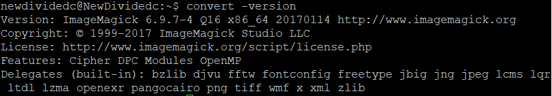

  * 编写代码 [task1.sh](https://github.com/CUCCS/linux-2020-NewDividedc/blob/chap0x04/chap0x04/code/task1.sh)
  
  * 支持命令行参数方式使用不同功能
  
  * 支持对指定目录下所有支持格式的图片文件进行批处理
  
    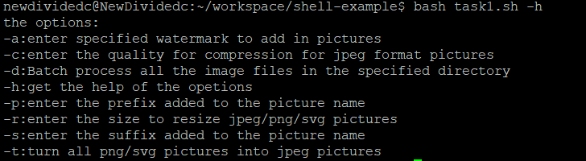

  * 支持对jpeg格式图片进行图片质量压缩
    
    * 压缩前compress目录下图片
    
      

    * 压缩图片命令
      
      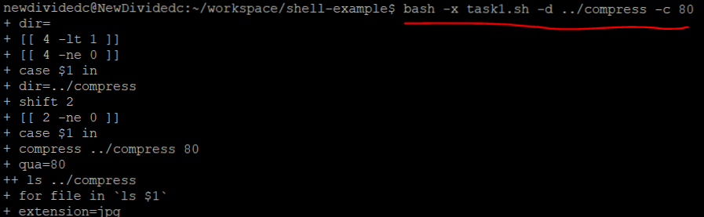

    * 压缩后compress目录下照片
      
      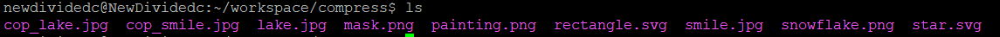

    * 压缩前后图片大小比较
     
      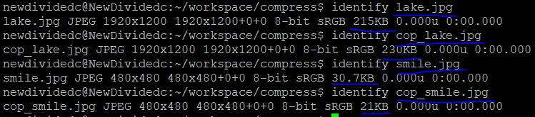
  
  * 支持对jpeg/png/svg格式图片在保持原始宽高比的前提下压缩分辨率
    
    * 压缩分辨率前resize目录下的图片
   
      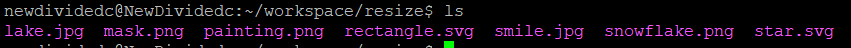

    * 压缩分辨率命令

      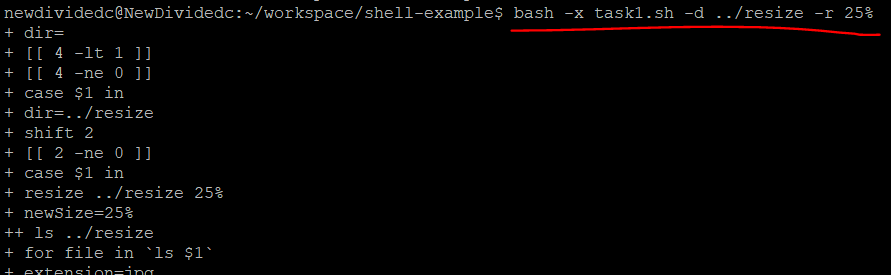 

    * 压缩分辨率后resize目录下的图片
      
      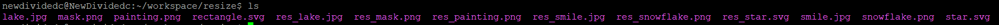

    * 压缩分辨率后图片大小比较
  
      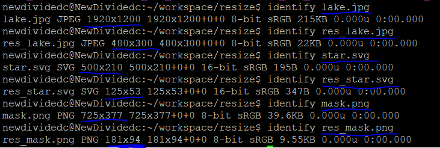

  * 支持对图片批量添加自定义文本水印

    * 添加水印前a目录下的图片
   
      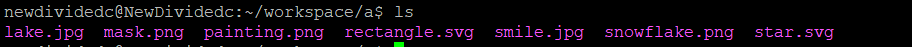

    * 添加水印命令

      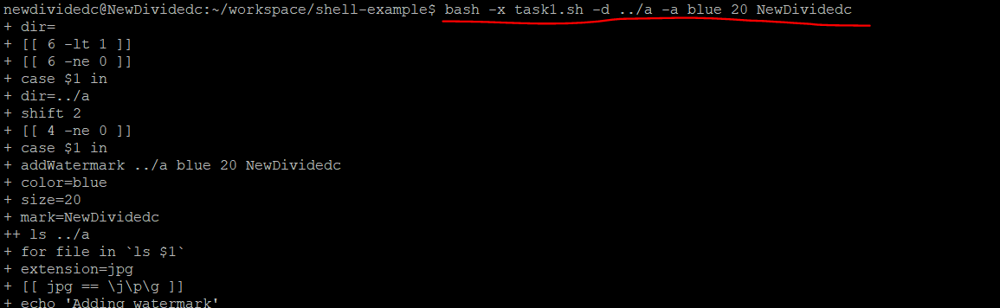 

    * 添加水印后a目录下的图片
      
      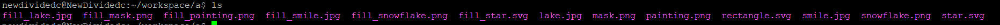

    * 使用psftp获得上水印后的图片
  
      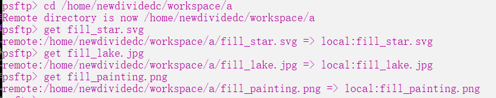

    * 加上水印前后图片比较 ([加水印前图片1](task1image/lake.jpg) [加水印后图片1](task1image/fill_lake.jpg) )
      
      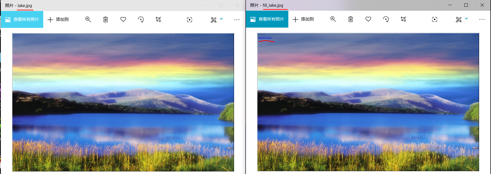

    * 加上水印前后图片比较2 ([加水印前图片2](task1image/painting.png) [加水印后图片2](task1image/fill_painting.png) )
      
      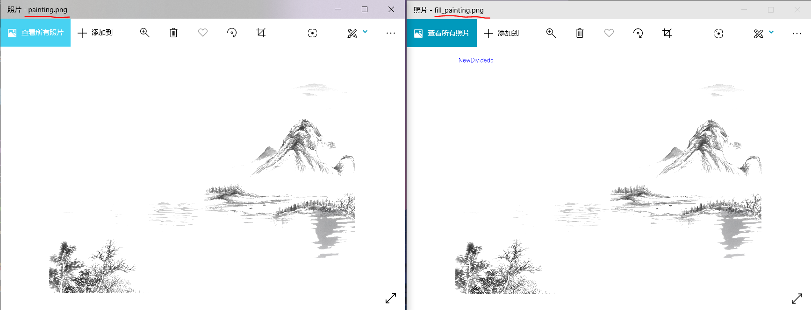
  
  * 支持批量重命名（统一添加文件名前缀或后缀，不影响原始文件扩展名）
    
    * 添加前缀名前prefix目录
   
      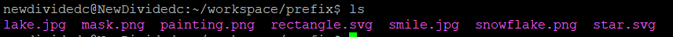

    * 添加前缀命令

      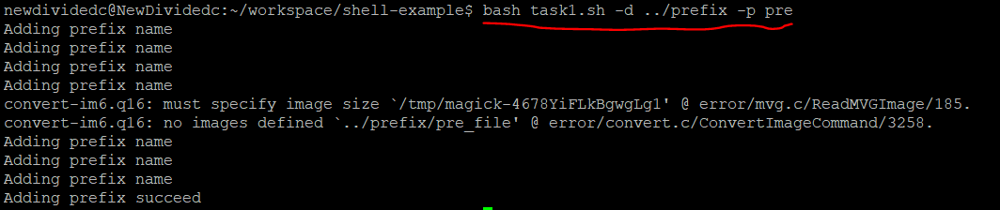 

    * 添加前缀名后prefix目录
      
      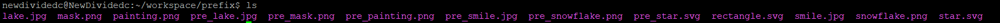

    * 添加后缀名前suffix目录
   
      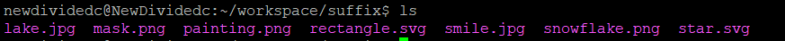

    * 添加后缀命令

      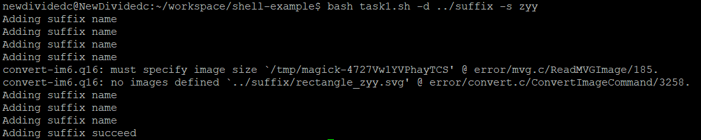 

    * 添加后缀名后suffix目录
      
      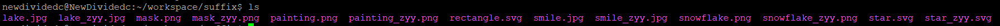

  * 支持将png/svg图片统一转换为jpg格式图片
    
    * 转换图片格式前transform目录
   
      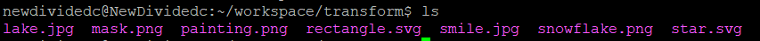

    * 转换图片格式命令

      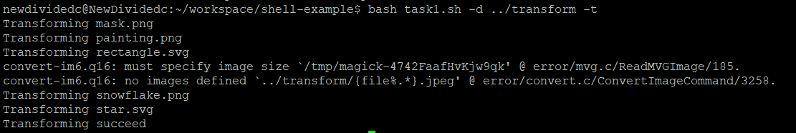 

    * 转换图片格式后transform目录
      
      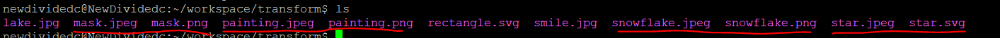

* 任务二
  
  * 下载文档
  
  * 编写代码 
    
    * 运动员数据统计代码 [task2.sh](https://github.com/CUCCS/linux-2020-NewDividedc/blob/chap0x04/chap0x04/code/task2.sh)
    
    * web访问数据统计代码 [task3.sh](https://github.com/CUCCS/linux-2020-NewDividedc/blob/chap0x04/chap0x04/code/task3.sh)

  * 具体统计数据见[任务二统计结果](https://github.com/CUCCS/linux-2020-NewDividedc/tree/chap0x04/chap0x04/任务二统计结果.md)

## 参考文献
* [linux-2019-Cassie8888](https://github.com/CUCCS/linux-2019-Cassie8888/tree/linux_04/linux04)

* [ubuntu 安装ImageMagic](https://blog.csdn.net/jacke121/article/details/76126245)

* [【ubuntu】imagemagick用法](https://www.cnblogs.com/xweiwei/archive/2011/02/21/1959467.html)

* [shell：遍历目录和子目录的所有文件](https://blog.csdn.net/seek_0380/article/details/78669354)

* [shell脚本字符串截取的8种方法](https://www.cnblogs.com/hurryup/articles/10241601.html)

* [Shell脚本中awk指令的用法](https://www.jb51.net/article/157432.htm)

* [shell中的浮点数运算](https://www.cnblogs.com/qqcwannagraduate/p/5291956.html)

* [shell 使用指定的分割符来分割字符串](https://blog.csdn.net/lw305080/article/details/78594011)

* [Linux awk+uniq+sort 统计文件中某字符串出现次数并排序](https://www.cnblogs.com/wangbaihan/p/9262296.html)

* [shell--grep命令+正则表达式+基本语法](https://www.cnblogs.com/metianzing/p/6938473.html) 