# 任务二数据统计结果

## 2014世界杯运动员数

* 运动员数据帮助信息
    
    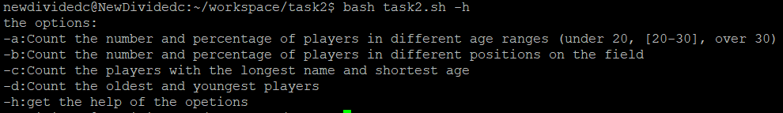

* 统计不同年龄区间范围（20岁以下、[20-30]、30岁以上）的球员数量、百分比
  
  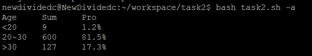

* 统计不同场上位置的球员数量、百分比
  
  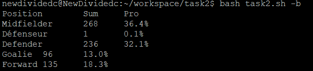

* 名字最长的球员是谁？名字最短的球员是谁？
  
  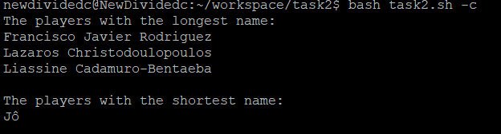

* 年龄最大的球员是谁？年龄最小的球员是谁？
  
  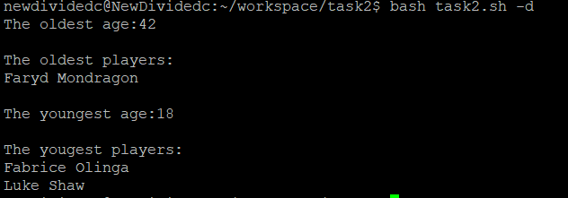

## Web服务器访问日志 

* Web服务器访问日志数据帮助信息
    
    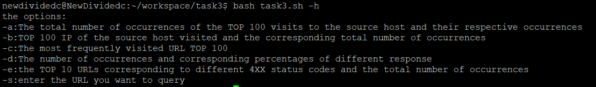

* 统计访问来源主机TOP 100和分别对应出现的总次数 (具体数据见[web.txt](https://github.com/CUCCS/linux-2020-NewDividedc/blob/chap0x04/chap0x04/web.txt))
  
  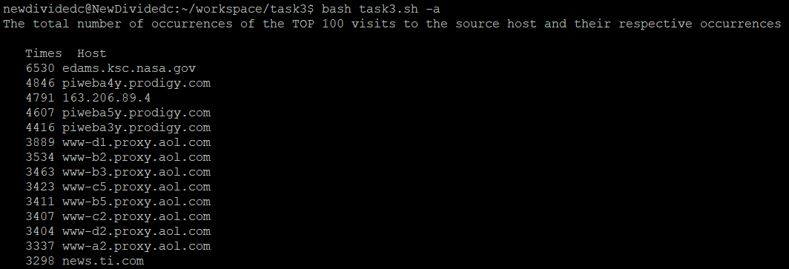

* 统计访问来源主机TOP 100 IP和分别对应出现的总次数(具体数据见[web.txt](https://github.com/CUCCS/linux-2020-NewDividedc/blob/chap0x04/chap0x04/web.txt))
  
  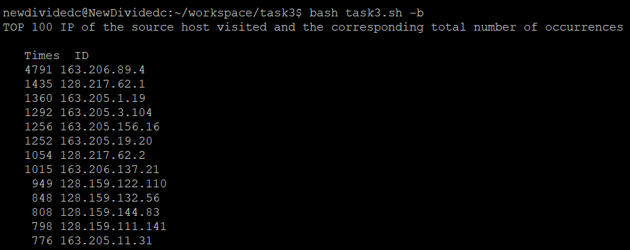

* 统计最频繁被访问的URL TOP 100(具体数据见[web.txt](https://github.com/CUCCS/linux-2020-NewDividedc/blob/chap0x04/chap0x04/web.txt))
  
  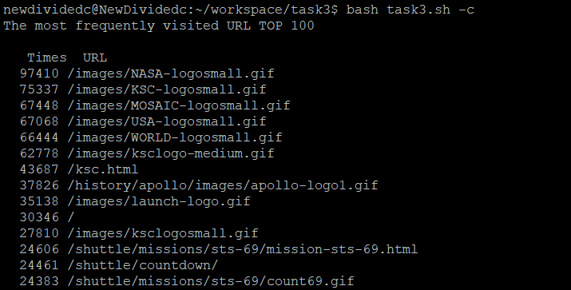

* 统计不同响应状态码的出现次数和对应百分比
  
  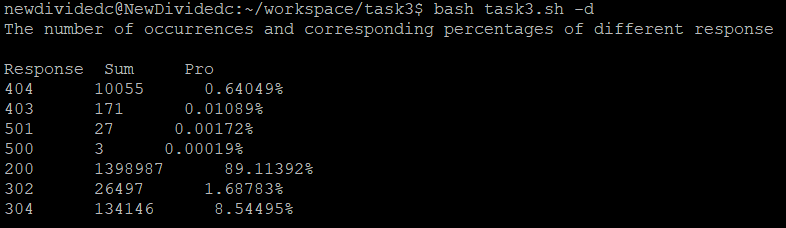

* 分别统计不同4XX状态码对应的TOP 10 URL和对应出现的总次数
  
  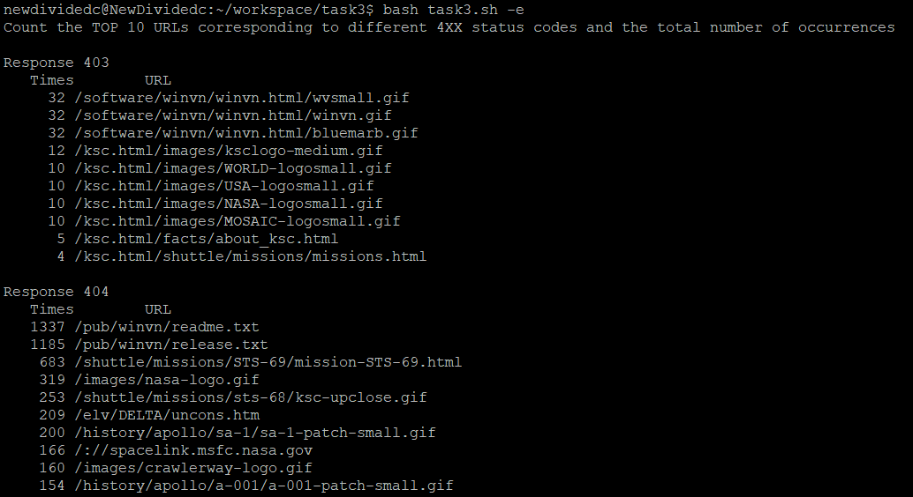

* 给定URL输出TOP 100访问来源主机(具体数据见[web.txt](https://github.com/CUCCS/linux-2020-NewDividedc/blob/chap0x04/chap0x04/web.txt))
  
  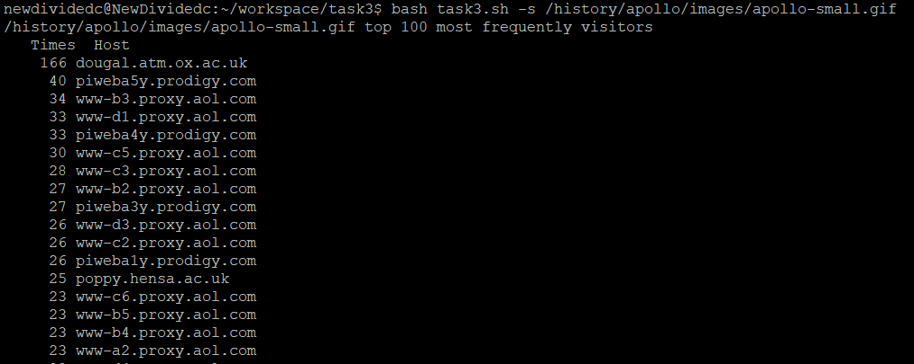
